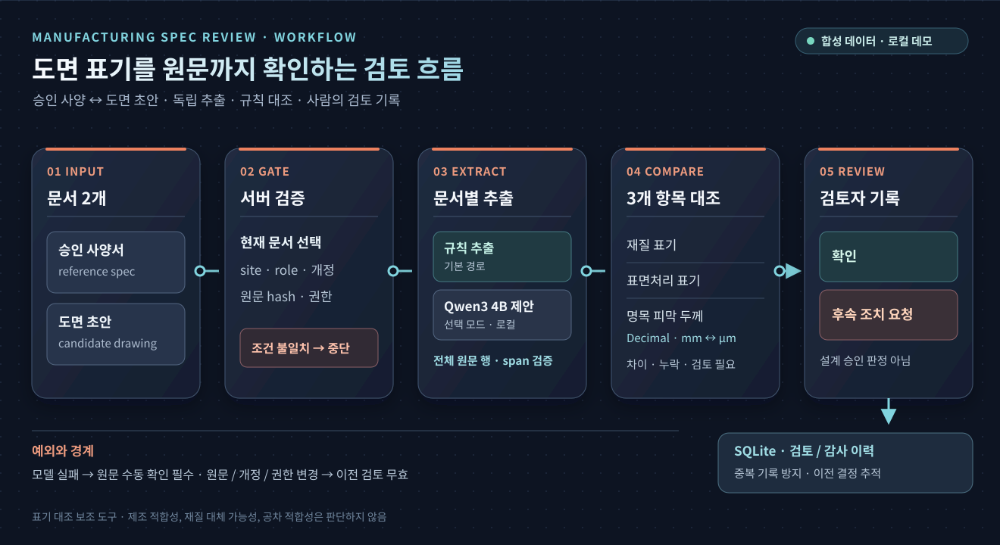
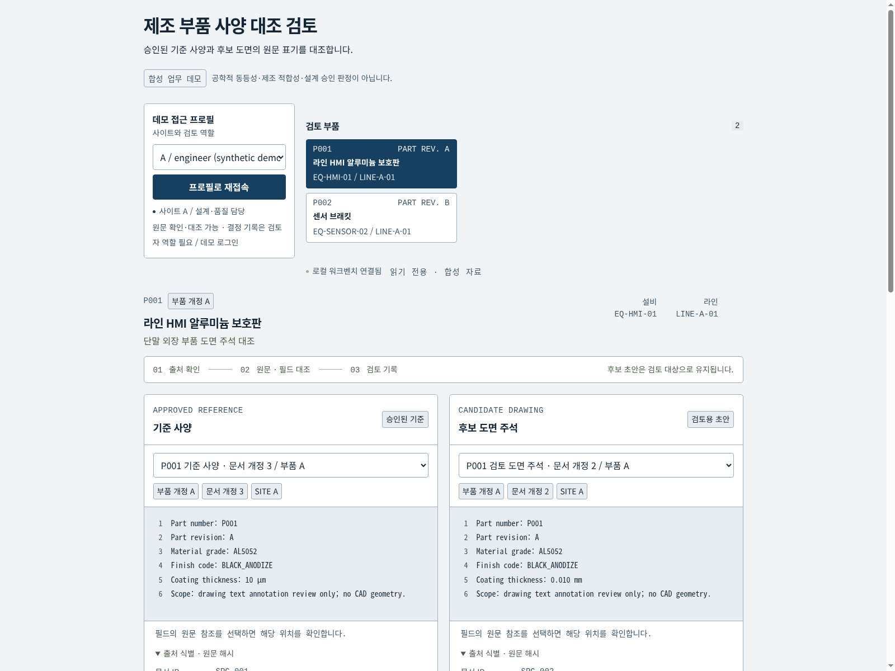
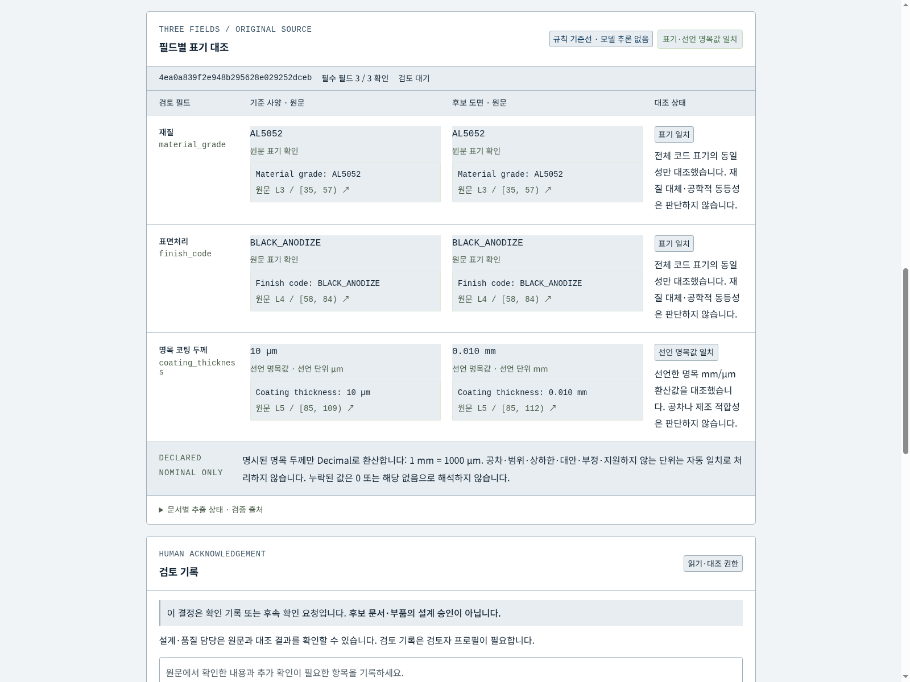
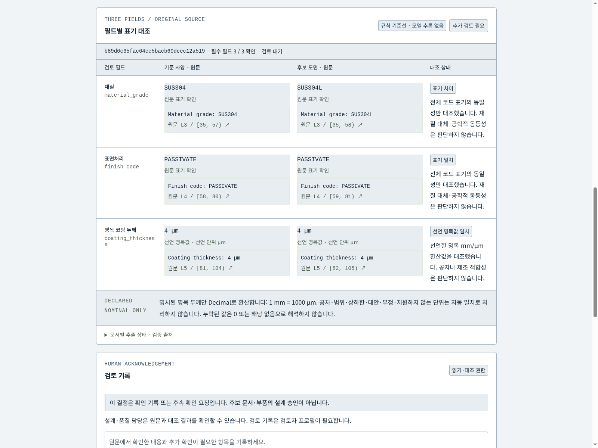
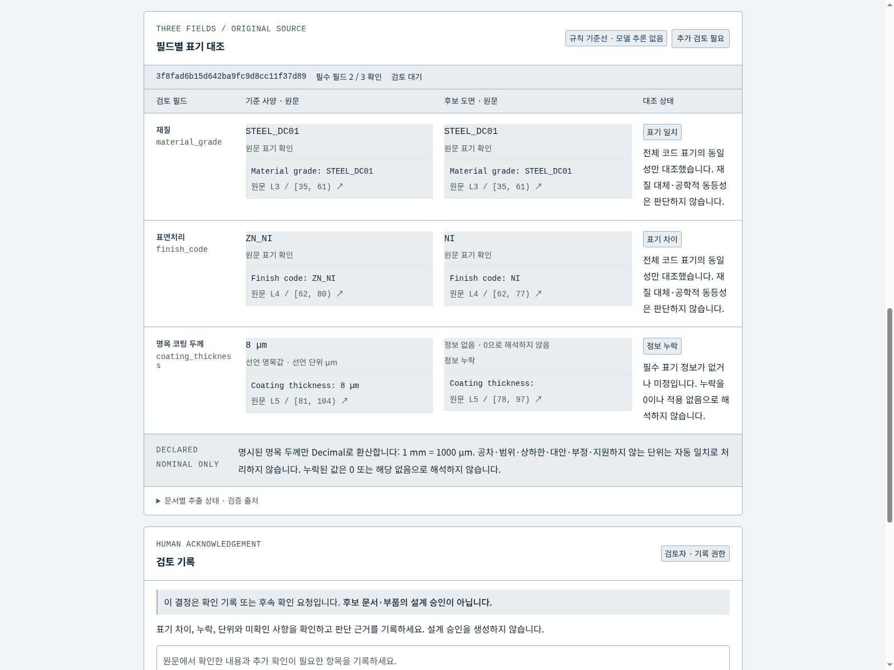
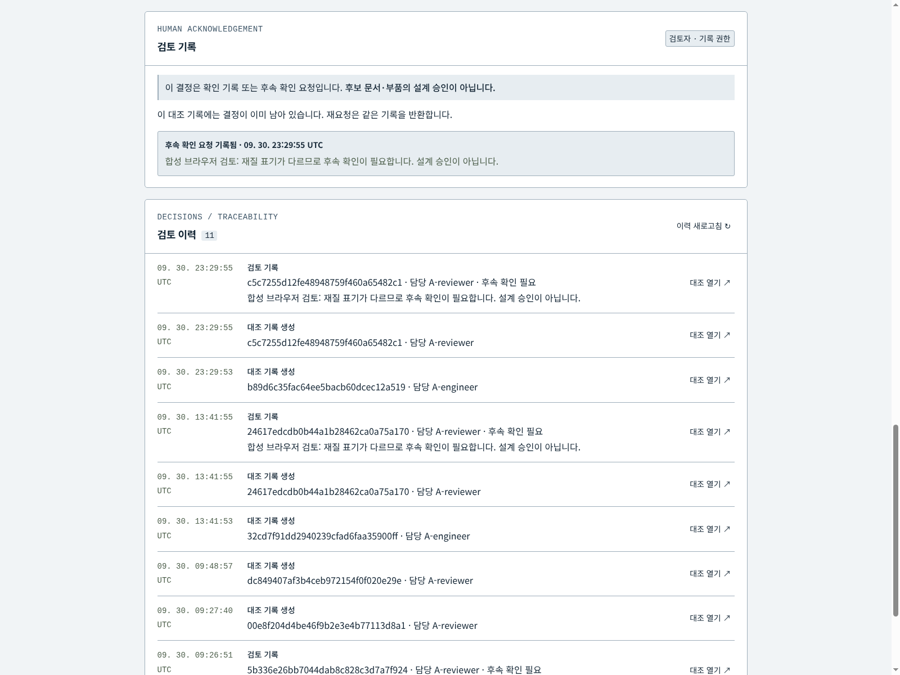
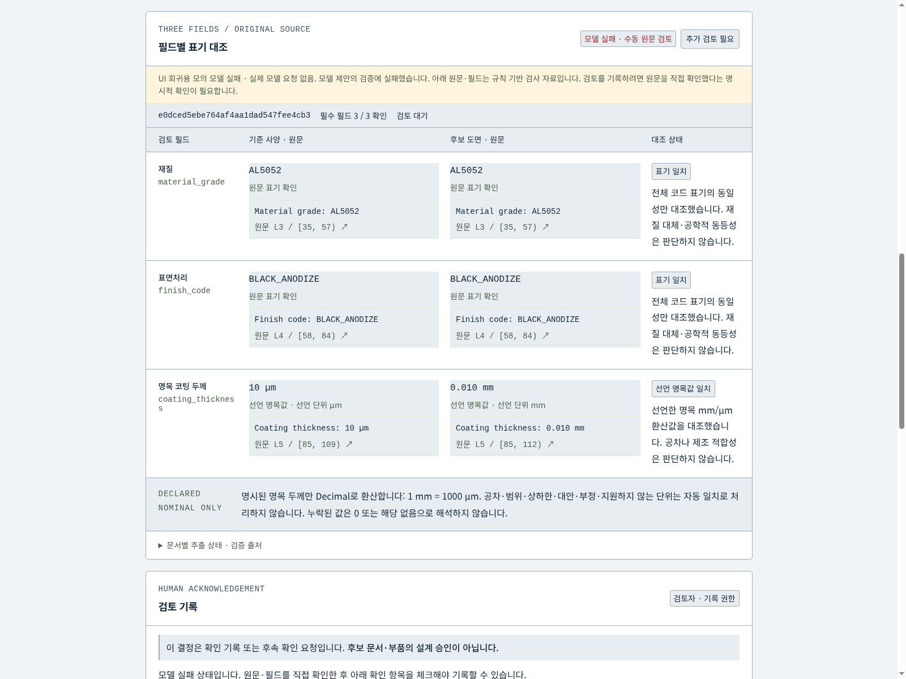
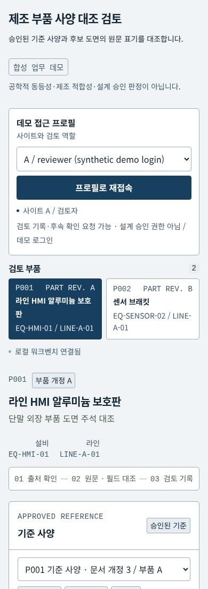
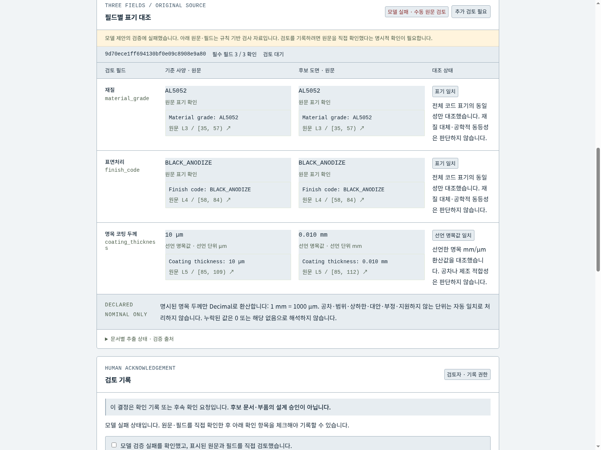
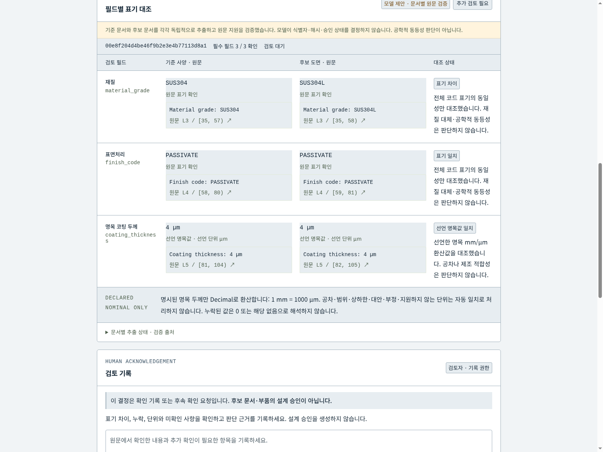

# 제조 부품 사양 대조 검토

[Editable SVG](docs/architecture.svg) · [Architecture provenance](docs/architecture-provenance.md)

Browser and authorized JSON feed Python source validation and Decimal comparison. Optional Ollama/Qwen extracts each document separately and serially; human review and audit persist in SQLite.

승인된 부품 사양서와 검토 중인 도면 텍스트 주석의 **재질·표면처리·명목 피막 두께**를 원문과 함께 대조하는 자체 합성 업무 데모입니다. Qwen3 4B는 문서별 추출을 제안하고, 대조·단위 변환·출처·권한·검토 상태는 서버 규칙이 담당합니다.

대상 사용자는 제조 설계·품질 검토자와 부품 문서 담당 엔지니어입니다. 부품 개정과 문서 개정을 구분하고 승인 사양을 기준으로 candidate draft를 검토합니다. 사람의 기록은 확인/후속 조치 요청이며 설계 승인이나 제조 적합성 판정이 아닙니다.

## 한눈에 보는 검토 흐름

[도식 크게 보기](docs/workflow-overview.svg)

규칙 추출은 기본 경로입니다. Qwen3 4B는 선택한 모델 모드에서 **각 문서를 따로 읽고 추출만 제안**합니다. 서버는 제안을 원문 행·위치와 대조하고, 표기 비교와 검토 상태를 결정합니다. 모델 실패 시 원문 수동 확인을 거쳐야 검토를 기록할 수 있습니다.

## 공개 기업 사례와 재현 범위
[Panasonic Connect 공식 발표 (2026-02-19)](https://news.panasonic.com/jp/press/jn260219-1)는 PDF 도면·기술 사양의 재질·마감 대조와 담당자 확인 지원을 소개합니다. 그 공개 업무를 작은 로컬 구현으로 재현하며 기업 내부 아키텍처를 복제했다고 주장하지 않습니다.

| 공개 업무 | 자체 재현 기능 | 검증 자료 | 아직 없는 부분 |
|---|---|---|---|
| 도면·사양 대조 | 3개 가상 부품, 승인 사양/초안 도면 텍스트 6개 | 고정 입력과 16개 gold | 임의 PDF/OCR/CAD geometry |
| 재질·마감 추출 | 독립 Qwen 제안, 전체 행 인용·span/hash 검사 | 실제 모델 6개 문서 | 일반 문서 정확도 입증 |
| 담당자 확인 | 차이·누락·단위 변환, 검토·감사 | 실제 UI와 API 테스트 | 기업 SSO·PLM/ERP |
| 업무 개선 | 재현 평가·실패 기록 | [평가](docs/evaluation.md) | 실제 공장 ROI/공수 절감 |
기업 발표의 효과는 이 프로젝트 성과가 아닙니다. 제조 전문가 검증으로 표현하지 않습니다.

## 현재 실제 화면

승인된 P09 v2 개발 화면의 밝은 회색 바탕, 남색 문자·버튼, 흰색 원문 카드와 두 칸 구성을 이 업무 화면에 적용했습니다. 아래는 **새 스타일을 실제 Chrome에서 다시 캡처한 화면**입니다. 합성 문서만 표시하며 화면 합성이나 모델 재실행은 하지 않았습니다. [현재 11개 상태 전체와 캡처 근거](docs/demo/current/README.md) · [새 실제 동작 영상 (9.47초, 무음)](docs/demo/current/video/nota-workflow.mp4). 기존 [초기 화면 갤러리](docs/demo/README.md)는 이전 UI의 역사적 기록입니다.

### 1. 기준 사양과 후보 도면

두 문서의 역할, 부품·문서 개정과 원문 출처를 나란히 확인합니다.

### 2. 명목 두께의 선언 단위 대조

규칙 기준선은 10 µm와 0.010 mm를 선언된 단위 규칙으로만 대조합니다.

### 3. 재질 코드 표기 차이

SUS304와 SUS304L은 별도 표기이며 대체 적합성은 판단하지 않습니다.

### 4. 누락과 표면처리 차이

빈 두께를 0으로 채우지 않고 추가 검토로 남깁니다.

### 5. 사람의 후속 확인과 이력

후속 확인은 설계 승인이 아닙니다. 반복 제출도 새 승인으로 처리하지 않습니다.

### 6. 실패 시 수동 원문 확인

이 화면은 **브라우저 응답을 모의한 실패**이며 실제 모델 요청은 0회입니다.

### 7. 모바일 원문 검토

390px Chrome 화면에서 가로 넘침 없이 문서와 비교로 이동합니다.

### 8. 기존 실제 모델의 인용 실패

과거 실제 모델 추출의 인용 오류를 저장 결과에서 **읽기 전용**으로 다시 열었습니다. 새 추론은 없습니다.

### 9. 기존 실제 모델의 재질 대조

과거 P002 실제 모델 제안을 저장 결과에서 **읽기 전용**으로 다시 열었습니다. 원문 검사 통과는 공학적 동등성 판정이 아닙니다.

## 업무 흐름
1. 합성 site A/B와 engineer/reviewer 프로필을 선택합니다.
2. 부품·설비·라인, 승인 기준/초안 도면의 부품 개정과 문서 개정을 확인합니다.
3. 규칙 비교 또는 모델 추출을 실행합니다. 모델 입력은 해당 문서 한 개의 원문입니다.
4. 각 필드 전체 원문 행·line/span·hash, 표기 차이·정보 부족을 확인합니다.
5. reviewer가 확인 또는 후속 조치를 기록합니다. 모델 실패 시 명시적 수동 원문 확인이 필요합니다.
6. 원문/개정/권한 변경은 이전 검토를 무효화합니다. 반복·동시 검토는 한 건으로 기록합니다.

P001: AL5052 / BLACK_ANODIZE / 10 µm 대 0.010 mm → 선언된 명목 표기 일치.
P002: SUS304 대 SUS304L → 재질 표기 차이, 대체 적합성 판정 없음.
P003: ZN_NI 대 NI + 빈 두께 → 표면처리 차이와 정보 부족.

## 아키텍처
[상세 아키텍처와 신뢰 경계](docs/architecture.md)에는 현재 개정 선택, site/role 접근, source hash, 문서별 독립 추출, SQLite 검토 무효화 조건을 정리했습니다. 인용 존재와 필드 일치를 검사하지만 범용 의미 검증·제조적 동등성 검증을 완료했다고 주장하지 않습니다. 기준 값이 후보 누락에 복사되지 않도록 두 모델 입력을 분리합니다. 정답은 evaluator-only 경로에 있고 런타임/모델에 들어가지 않습니다.

## 설치·실행
Linux, Python 3.10 이상. 외부 Python 패키지 없이 규칙 데모와 테스트를 실행합니다.
~~~sh
git clone https://github.com/Kimhyuntae9665/manufacturing-spec-review.git
cd manufacturing-spec-review
python3 -m venv --without-pip .venv
.venv/bin/python -m unittest discover -s tests -v
.venv/bin/python scripts/evaluate_frozen.py
.venv/bin/python -m spec_review.server --port 19081
~~~
브라우저에서 http://127.0.0.1:19081 을 엽니다. 서버는 loopback에만 바인딩합니다. demo profile을 누구나 선택할 수 있으므로 실제 기업 인증이 아닙니다. 외부 공개 서버에 배포하지 마세요.
모델 모드는 **기존** Ollama http://127.0.0.1:11434 의 qwen3:4b를 사용합니다. 모델 다운로드·Ollama 설정 변경은 하지 않습니다. 모델이 없으면 규칙 비교/수동 확인으로 동작합니다.
~~~sh
.venv/bin/python scripts/live_model_eval.py
~~~
자체 서버가 켜져 있어야 하며 3개 고정 합성 쌍을 순차 요청합니다.

## 모델·자원·실측
Ollama v0.17.7, 기존 Qwen3 4B Q4_K_M, RTX4060 8GB에서 측정했습니다. 모델 Apache-2.0 조건은 원 배포에서 확인하세요. 모델 파일은 저장소에 없습니다.

- 문서 하나씩 별도 추출; 두 문서는 순차 요청.
- num_ctx 4096, 출력 512 tokens, temperature 0, think:false/truncate:false/shift:false 요청.
- 원문 UTF-8 6,000 bytes 상한; 초과하면 요청 전에 거부.
- quote 후보는 원문의 전체 행입니다. 올바른 필드의 행·값인지는 서버가 다시 검사합니다.
- 여러 clone/project는 사용자 runtime OS lease를 공유합니다. timeout은 지속 blocked marker로 새 추론을 차단합니다. [복구 정책](docs/inference-policy.md).
- 보강 후 3쌍/6문서 원문 검사 통과: 비교 지연 5.70 / 3.77 / 3.67초, 관측 최대 VRAM 3,610 MiB.
- 앞선 실제 실패 1건: 두께 인용의 콜론 추가 → 거부/수동 확인. [실패 기록](docs/failure-log.md).
- 이번 JSON 응답 thinking 0자를 관측했습니다. 자유문장 thinking/off 지원까지 입증하지는 않습니다.

## 평가 범위
| 구분 | 결과 | 해석 |
|---|---|---|
| Engineering | 72 unittest 통과 | 규칙/출처/ACL/개정/검토/동시성/실패/mocked transport |
| 사전 고정 합성 gold | 16/16, 모델 요청 0 | 구현 전 고정된 규칙 기대값, 공장 heldout 아님 |
| 실제 모델 개발 사례 | 보강 후 3쌍/6문서 원문 검사 통과 | 동일 개발 입력, 앞선 실패 별도 |
| 실제 UI | 3부품·역할·인용·감사·모바일 | baseline/명시적 failure mock 구분 |
분모를 합친 종합 정확도는 만들지 않습니다. 현재 명확한 필드 라벨을 지원하며 모든 문서를 잘 읽는다는 결론은 낼 수 없습니다.

## 제한·로드맵
공차·범위·부등호·optional/or equivalent/금지 표기는 needs_review입니다. mm/µm 외 단위는 변환하지 않습니다. N/A·빈값은 0 또는 적용 없음으로 해석하지 않습니다. SUS304와 SUS304L은 다른 표기입니다.
현재 원문은 합성 텍스트입니다. PDF/OCR/CAD geometry, 규격 적합성, 자동 설계 승인, 물리 제어, arbitrary shell, Docker socket, 외부 쓰기 tool은 없습니다.
후속 범위: 별도 신규 문서 일반화 평가, PDF 텍스트 importer/provenance, 기업 인증 어댑터, 비활성 [n8n 수집·검토 연결 설계](docs/n8n-adapter.md).

## 데이터·라이선스
코드와 자체 synthetic fixtures는 MIT입니다. 모든 부품·설비·라인·문서·기록은 가상입니다. Panasonic 발표는 참고 링크이며 본문/이미지를 재배포하지 않습니다. 모델과 기업 실제 데이터는 포함하지 않습니다.

## Readability verification

[Actual before/after desktop and 390px mobile screenshots](docs/readability.md) document the 2026-09-30 update: source and quote text >=14px, long Korean explanations and controls16px, and measured normal-text contrast >=4.70:1. Native mobile width390px and scale1, reduced-motion scrolling, original-source quotation and reviewer acknowledgement boundaries passed without model requests. The retained video and stored-model screenshots predate this typography pass.
