# 실제 동작 화면 갤러리

> **이전 UI의 역사적 캡처입니다.** 승인된 P09 v2 시각 기준을 적용한 현재 화면은 [새 갤러리](current/README.md)와 [현재 영상](current/video/nota-workflow.mp4)에 있습니다. 아래 파일은 이전 결과와 실패 기록의 원본 보존용입니다.

[실제 동작 영상 (9초, 무음)](video/nota-workflow.mp4): P001 원문 → P002 재질 차이 → P003 누락 → 기존 실제 모델 P002 결과 조회 → 원문 인용 강조. 녹화 중 새 GPU 요청0회; 원본35프레임 (마지막 홀드 포함 인코딩36프레임)과 timestamp manifest를 video/에 함께 보존했습니다.

가상 부품·합성 문서만 사용한 실제 브라우저 캡처입니다. 화면을 수정해 성공을 연출하지 않았습니다. 06은 명시적인 실패 mock이며 08은 실제 모델 인용 거부,09–11은 실제 모델 원문 검사 통과 결과입니다. 저장 결과를 다시 열어 캡처할 때 새 GPU 추론은 실행하지 않았습니다.

| 화면 | 보여주는 업무 | 실행 구분 |
|---|---|---|
| [01](01-reference-candidate-provenance.png) | 승인 기준과 초안 후보: 부품/문서 개정·원문 hash | 원문 조회 |
| [02](02-declared-nominal-conversion.png) | 10 µm와0.010 mm 명목 표기 대조 | 규칙 baseline |
| [03](03-material-notation-difference.png) | SUS304 대 SUS304L 표기 차이 | 규칙 baseline |
| [04](04-finish-difference-missing-thickness.png) | 표면처리 차이와 두께 정보 부족 | 규칙 baseline |
| [05](05-followup-record-and-audit.png) | 후속 확인과 감사 이력 | 규칙 baseline |
| [06](06-mock-failure-manual-confirmation.png) | 명시적 브라우저 실패 mock; 실제 추론0회 | MOCK — 실제 모델 실패 아님 |
| [07](07-mobile-source-workspace.png) | 모바일 원문·필드 검토 | 규칙 baseline |
| [08](08-real-model-failure-manual-review.png) | 실제 인용 오류로 거부된 결과; 수동 확인 필요 | 실제 모델 실패 저장 결과 GET |
| [09](09-stored-real-model-p001.png) | 명목값 단위 대조 | 실제 모델 추출 저장 결과 GET |
| [10](10-stored-real-model-p002.png) | 재질 표기 차이 | 실제 모델 추출 저장 결과 GET |
| [11](11-stored-real-model-p003.png) | 표면처리 차이와 빈 두께 | 실제 모델 추출 저장 결과 GET |

## 01. 승인 기준과 초안 후보: 부품/문서 개정·원문 hash

원문 조회

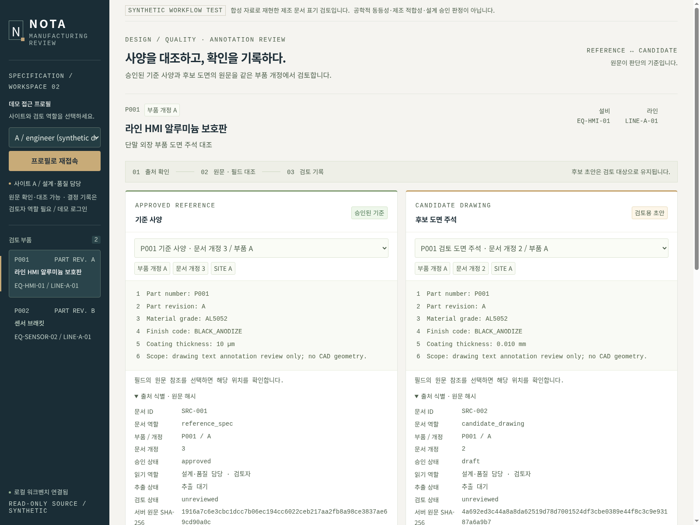

## 02. 10 µm와0.010 mm 명목 표기 대조

규칙 baseline

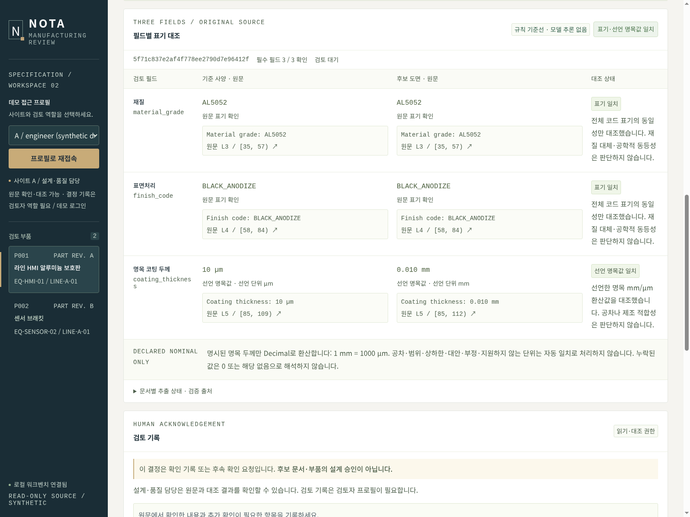

## 03. SUS304 대 SUS304L 표기 차이

규칙 baseline

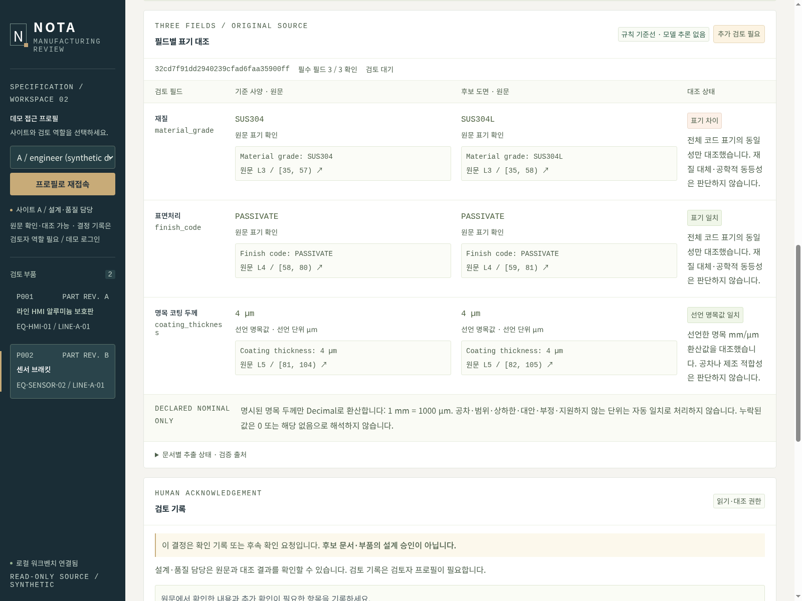

## 04. 표면처리 차이와 두께 정보 부족

규칙 baseline

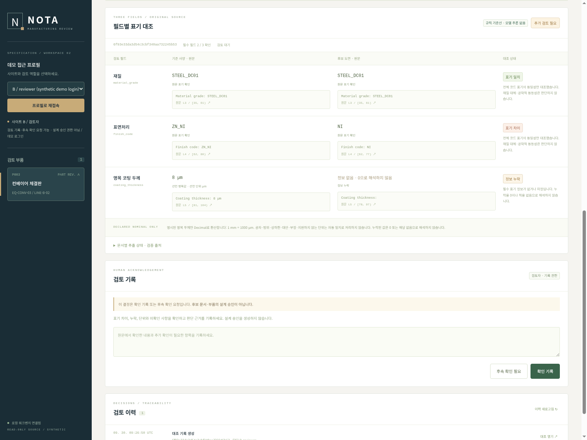

## 05. 후속 확인과 감사 이력

규칙 baseline

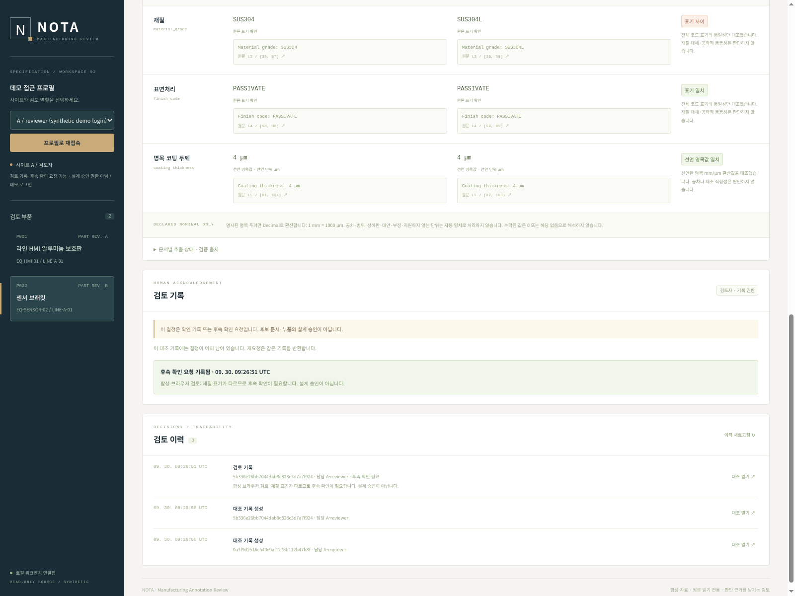

## 06. 명시적 브라우저 실패 mock; 실제 추론0회

MOCK — 실제 모델 실패 아님

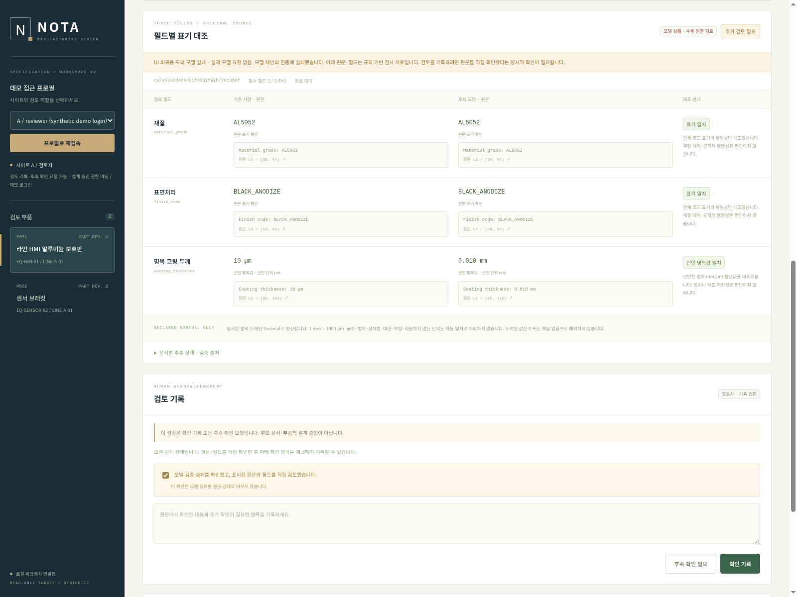

## 07. 모바일 원문·필드 검토

규칙 baseline

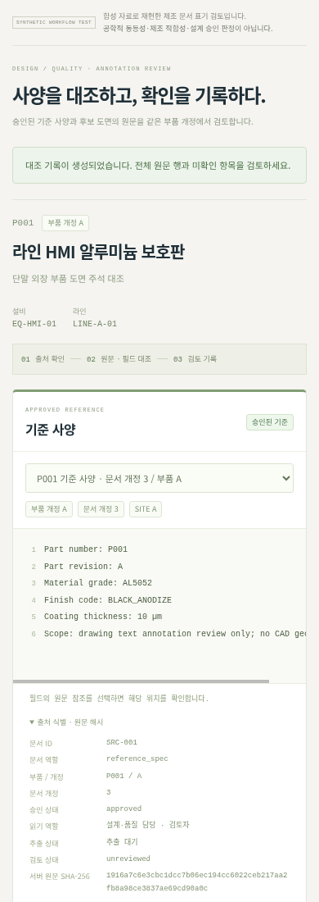

## 08. 실제 인용 오류로 거부된 결과; 수동 확인 필요

실제 모델 실패 저장 결과 GET

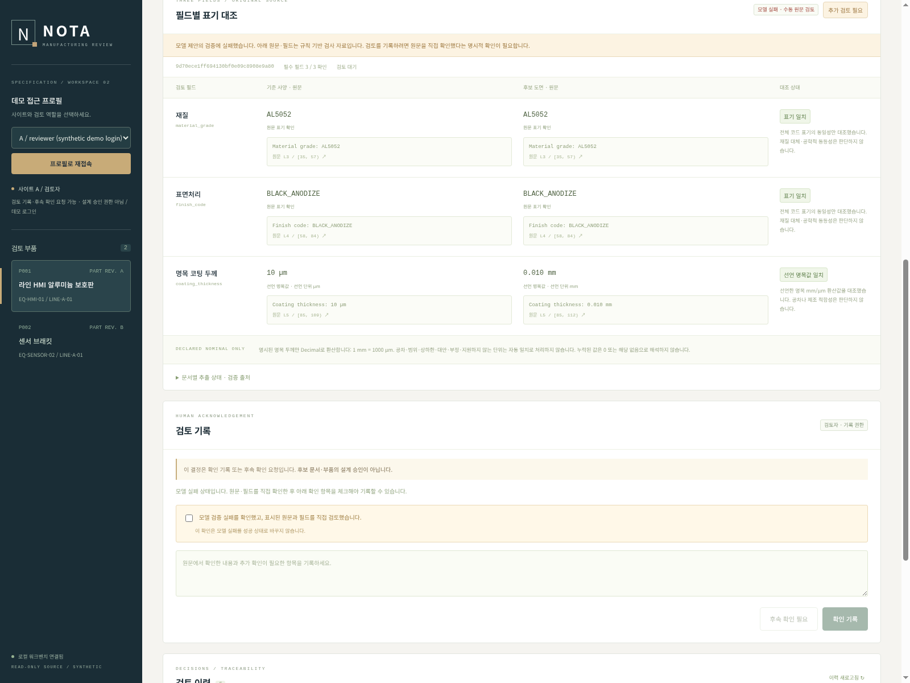

## 09. 명목값 단위 대조

실제 모델 추출 저장 결과 GET

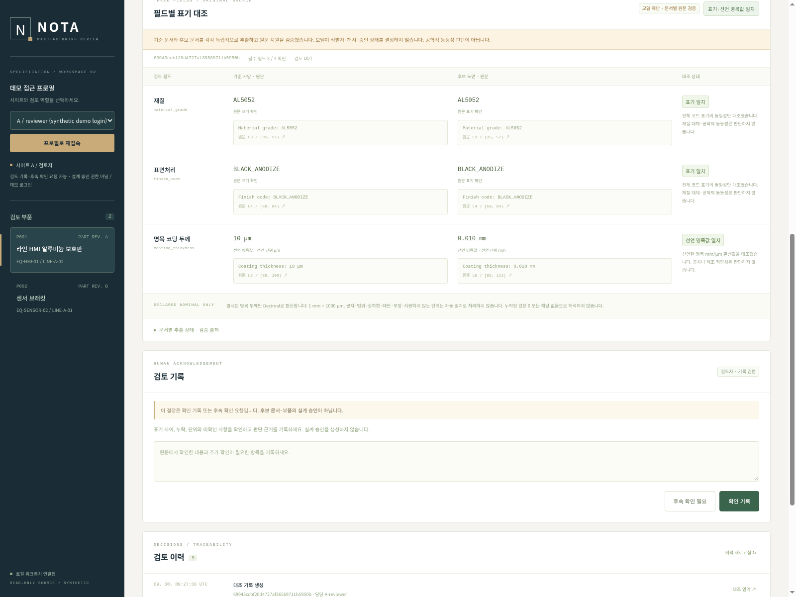

## 10. 재질 표기 차이

실제 모델 추출 저장 결과 GET

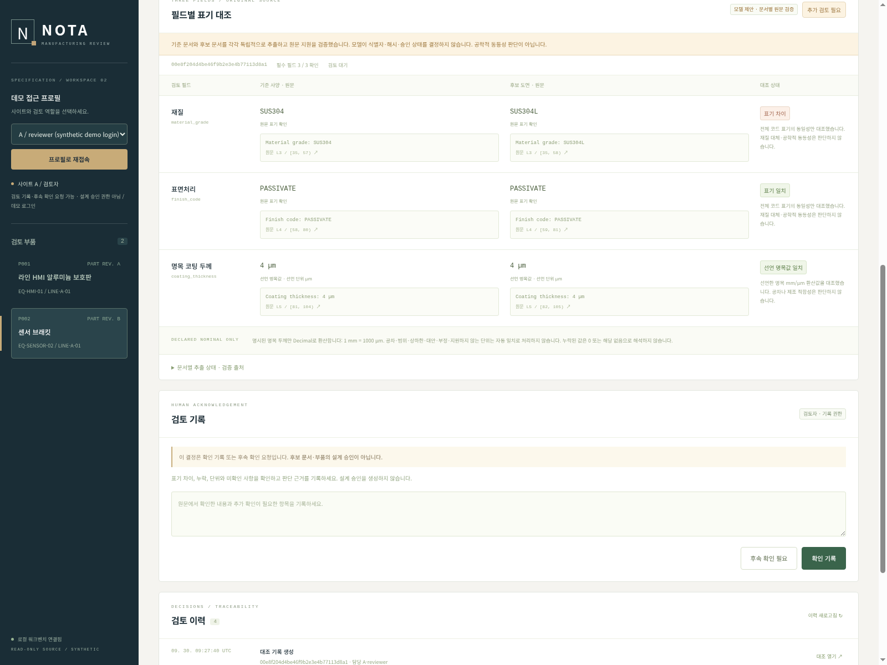

## 11. 표면처리 차이와 빈 두께

실제 모델 추출 저장 결과 GET

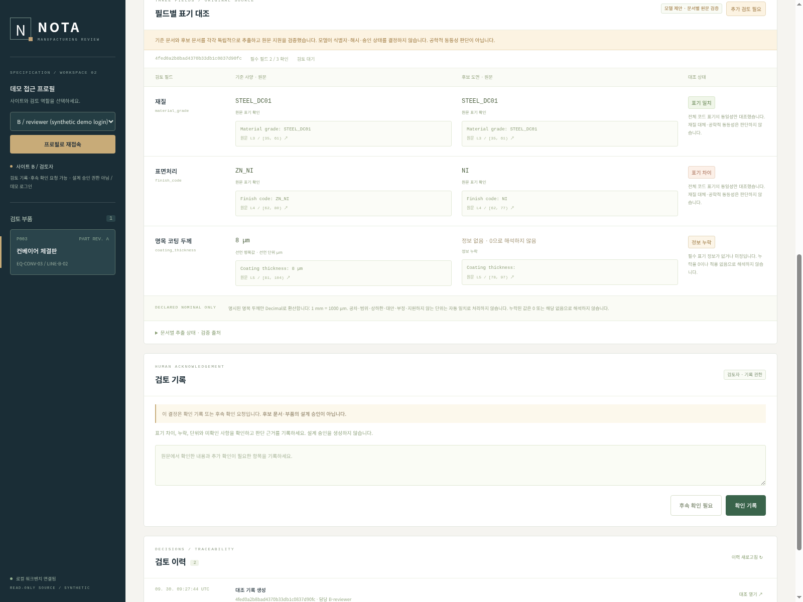

## Current readability captures

Screens01-07 above now show the readability update. Screens08-11 and the retained video are historical model evidence from the preceding typography. [Eight native before/after captures and measured limits](../readability.md) are recorded separately. Current baseline/browser-failure-mock checks made zero actual-model requests; the mock remains explicitly labelled.
